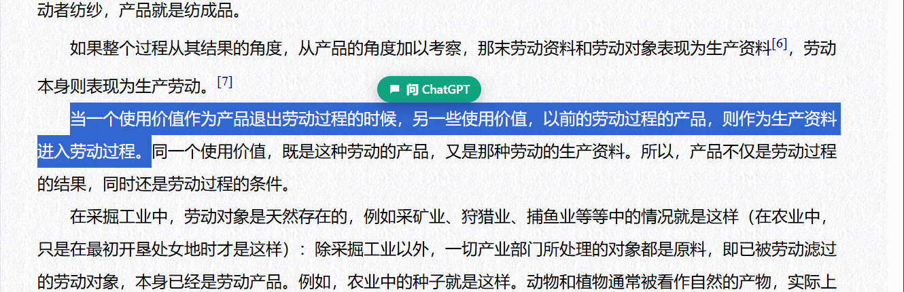
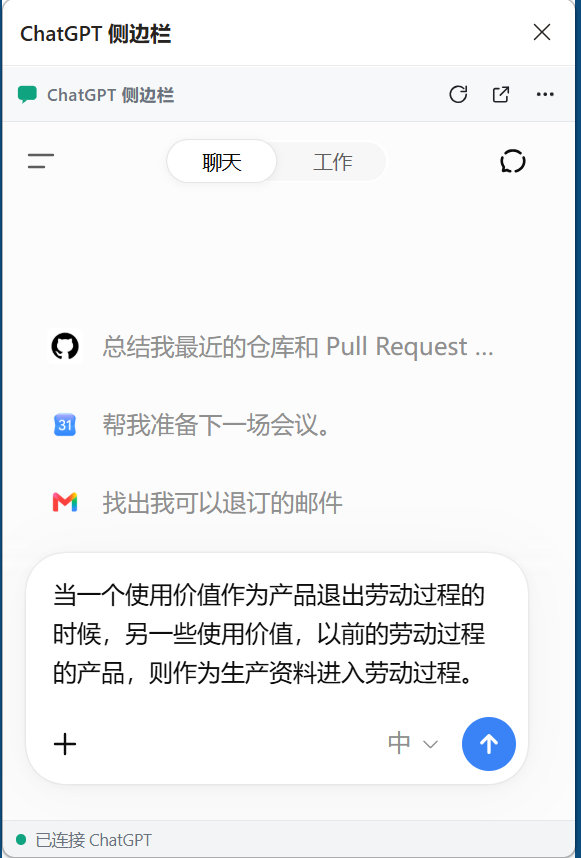

# ChatGPT 侧边栏 · Microsoft Edge 扩展

**简体中文** | [English](README.en.md) | [项目分享页](https://ayinmkf.github.io/edge-chatgpt-sidebar/)

在浏览网页时，把选中的文字交给 ChatGPT，帮助你解释概念、翻译段落、总结内容和辅助阅读。扩展默认在 Edge 侧栏内显示 ChatGPT，也提供将文字送到普通 ChatGPT 标签页的稳定投递方式。

当前版本：**v0.3.2**。这是非官方项目，与 OpenAI 或 Microsoft 没有隶属关系，也未获得其背书。

在 X/Twitter 分享时，请粘贴完整项目页链接：`https://ayinmkf.github.io/edge-chatgpt-sidebar/`。

## 使用预览

在普通网页选中文字后，绿色“问 ChatGPT”按钮会出现在选区附近：



点击按钮后，所选原文进入真实 ChatGPT 内嵌侧栏；下图关闭了自动发送，因此文字停留在输入框中等待确认：



预览截取自实际 Microsoft Edge 和 ChatGPT 页面，并已裁去账号、历史记录及其他标签。ChatGPT 页面外观可能随网站更新而变化。

## 1. 这个项目可以做什么？

例如，你正在阅读文章，遇到一段难懂的解释，可以选择这段文字，点击选区附近的“问 ChatGPT”，把它填入侧栏内的 ChatGPT。

扩展传送的是**你选中的原文**，不会自动添加“翻译”“解释”或“总结”等要求。第一次使用建议先关闭“写入后自动发送”，填入后自行补充指令：

| 场景 | 可以在原文前补充的要求 |
| --- | --- |
| 理解术语 | 请用适合初学者的语言解释下面这段话，并举一个例子。 |
| 阅读外文 | 请将下面这段文字翻译成中文，保留专业术语。 |
| 总结文章片段 | 请把下面内容总结成三个要点。 |
| 学习与复习 | 请根据下面内容提出三个自测问题，暂时不要给出答案。 |

它不是整页抓取工具，不会自动读取整篇文章，也不会因为你选中文字就发送。**必须点击浮窗或右键发送菜单才会开始投递。**

## 2. 使用前准备

- 一台安装了较新版本 Microsoft Edge 的电脑。本项目主要在 Windows 上开发和测试。
- 你的网络能够正常打开 [ChatGPT](https://chatgpt.com/)，并按网站要求完成登录或验证。
- 本项目使用 ChatGPT 网页，不需要配置 API Key，也不要求购买 API 服务。网页账号可用的功能、额度及订阅仍由 ChatGPT 决定。
- **普通使用者不需要 Node.js、Git 或命令行。** 它们只用于开发、测试或源码管理。

建议先在普通标签页确认 ChatGPT 可以正常使用。如果普通标签页也无法打开，安装本扩展不会解决网络或账号访问问题。

## 3. 下载与安装：第一次使用

本项目以“加载解压的扩展”方式安装，没有浏览器商店安装步骤。普通用户建议下载 [Releases](https://github.com/ayinmkf/edge-chatgpt-sidebar/releases/latest) 中的安装包。

1. 打开 [最新 Release](https://github.com/ayinmkf/edge-chatgpt-sidebar/releases/latest)，在 **Assets** 中下载 `edge-chatgpt-sidebar-v0.3.2.zip`。不要下载 GitHub 自动生成的 Source code 压缩包。
2. 下载后右键压缩包，选择“全部解压”，将文件放到你准备长期保留的位置。
3. 打开解压后的文件夹，找到直接包含 `manifest.json` 的那一层目录。旁边应有 `background`、`content`、`panel` 等文件夹。
4. 在 Edge 地址栏输入 `edge://extensions/`，按回车。
5. 打开页面上的 **开发人员模式** 开关。
6. 点击 **加载解压缩的扩展**（有的版本显示“加载解压的扩展”）。
7. 选择第 3 步找到的目录。不要选择 ZIP 文件，也不要选到 `panel` 子目录或外面多套的一层文件夹。
8. 确认扩展列表中出现 **ChatGPT 侧边栏**，并处于开启状态。
9. 点击 Edge 工具栏上的扩展图标，找到本扩展，选择显示在工具栏上；不同 Edge 版本可能显示图钉或眼睛图标。
10. 刷新你准备选中文字的网页，然后点击扩展图标打开侧栏。

安装后不要移动或删除这个文件夹，Edge 会继续从这里读取扩展文件。如果你需要源码，也可以在仓库首页点击 **Code → Download ZIP**；源码目录同样可以直接加载，无需构建。

如果有人给你本项目生成的 `edge-chatgpt-sidebar.zip`，同样先解压，再选择包含 `manifest.json` 的目录加载。不要同时加载两份，否则可能出现重复按钮。

## 4. 第一次成功投递

1. 点击工具栏中的“ChatGPT 侧边栏”图标。
2. 默认打开内嵌 ChatGPT。如果要求登录，请先完成登录；若内嵌无法完成验证，按第 6 节切换稳定投递。
3. 点击侧栏顶部的 **⋯ → 写入后自动发送**，首次尝试建议取消勾选。
4. 回到普通网页，用鼠标拖选两行文字，再松开鼠标。
5. 在选区附近点击绿色 **问 ChatGPT** 浮窗。
6. 等待文字出现在 ChatGPT 输入框。关闭自动发送时，它应停留在输入框中。
7. 在原文前补充“请解释这段话”等要求，检查内容，然后点击 ChatGPT 的发送按钮。
8. 确认对话中出现了自己的消息，再等待回复。

也可以选择文字后点击鼠标右键，选择“发送选中内容到 ChatGPT 侧边栏”。`Ctrl+Shift+Y` 用于打开侧栏，**不会自动发送当前选区**；快捷键可在 `edge://extensions/shortcuts` 中调整。

### 自动发送与仅填入

- **自动发送开启（默认）**：点击“问 ChatGPT”后，扩展尝试填入原文并点击发送。适合你希望直接发送所选内容的情况。
- **自动发送关闭**：点击后只填入，不提交。你可以补充要求、删改内容，再手动发送。适合翻译、解释、总结等需要附加指令的场景。

ChatGPT 输入框已有草稿时，扩展会停止写入，避免覆盖或误提交。请先发送、另存或清空旧草稿再试。

## 5. 设置在哪里？哪些会被记住？

在内嵌侧栏顶部点击 **⋯**，无需切到其他界面即可设置。窄侧栏中的菜单可以上下滚动。

| 设置 | 默认值 | 用途与保存方式 |
| --- | --- | --- |
| 写入后自动发送 | 开启 | 控制填入后是否提交；长期保存，两种界面共享 |
| 选中文本时显示“问 ChatGPT” | 开启 | 控制选区浮窗；长期保存，关闭后仍可用右键发送 |
| 紧凑模式 | 关闭 | 隐藏底部状态条，顶部设置仍可使用；长期保存 |
| 高级选项 → 稳定投递 | 关闭 | 使用普通 ChatGPT 标签页；仅保留到当前浏览器会话结束 |
| 高级选项 → 独立贴边窗口 | 关闭 | 打开或关闭独立 ChatGPT 窗口 |
| 高级选项 → 临时隐身 | 关闭 | 改变内嵌导航携带的登录信息；仅当前会话生效 |
| 高级选项 → 兼容写入 | 关闭 | 调整内嵌编辑器写入策略；长期保存 |
| 高级选项 → UA 伪装 | 关闭 | 尝试改变内嵌导航的浏览器标识；仅当前会话生效，不保证解决验证 |
| 高级选项 → 自检 / 诊断 | 手动运行 | 查看嵌入规则或输入框相关信息，供故障排查 |

模式切换在当前浏览器会话内有效。后台休眠、重新打开侧栏不会重置模式；**结束浏览器会话后重新启动、重新加载扩展或更新扩展后，恢复默认内嵌模式**。Edge 若仍在后台运行，仅关闭窗口可能并没有结束浏览器会话。

## 6. 三种使用方式与内嵌失败时的处理

| 方式 | ChatGPT 显示位置 | 使用时机 |
| --- | --- | --- |
| 内嵌侧栏（默认） | Edge 侧栏中 | 希望边看网页边聊天 |
| 稳定投递 | 同一浏览器窗口的普通 ChatGPT 标签页 | 内嵌受限、登录验证不成功，或需要队列和任务诊断 |
| 独立贴边窗口 | 单独的 ChatGPT 窗口 | 希望使用单独窗口并排阅读 |

### 切换稳定投递

1. 打开侧栏顶部 **⋯ → 高级选项**。
2. 点击 **切换到稳定投递（标签页）**。若仍停留在加载界面，也可以点击那里的“切换稳定投递”。
3. 侧栏会显示投递状态和任务记录。
4. 再从普通网页选择文字并点击“问 ChatGPT”。扩展选择**同一窗口最近使用的 ChatGPT 标签页**，没有时创建一个，并切换过去。
5. 若目标页面要求登录或验证，完成后在侧栏中对允许重试的失败任务点击“重试投递”。
6. 要恢复内嵌，点击稳定侧栏中的 **返回内嵌侧栏**。

切换模式不会自动把上一条文本重新发送。如果发送结果不确定，请先查看 ChatGPT 对话，避免重复提交。

### 稳定投递中的状态

- **已排队 / 等待 ChatGPT 就绪**：任务已保存，正在等待投递。
- **已填入**：文字进入输入框，需要检查并按需手动发送。
- **已发送**：扩展在页面观察到新用户消息，或输入框清空并开始生成；不保证服务器最终完成回答。
- **投递失败**：检查诊断，处理原因后对可重试任务重试。
- **发送状态未确认**：可能已提交，但回执不完整。先检查目标页面，不要重复发送。

稳定模式最多同时排队 20 条、保留 40 条记录，单条最多 20,000 字符；新任务记录入队时的自动发送设置。页面就绪等待约 30 秒，超时会反馈失败。内嵌模式沿用**单条待发送机制**，请等当前任务完成后再发送下一条。

内嵌会受网站反嵌入策略、账号、浏览器及网络环境影响。扩展不保证内嵌始终可用，也不绕过登录或人机验证。

## 7. 常见问题与更新

### 没有“问 ChatGPT”浮窗

先确认扩展已启用、设置中的浮窗开关已开启，并刷新来源网页。选择至少两个字符。Edge 内部页面、扩展商店及 ChatGPT 页面本身不显示这个浮窗；子框架中的文字可尝试右键菜单。

### 点击后提示“扩展已更新”或没有反应

按顺序操作：**重新加载扩展 → 刷新来源网页 → 重新选中文字**。不要刷新网页后又重新加载扩展，却没有再次刷新网页。若仍失败，检查是否加载了重复版本，并保存错误信息反馈。

### 提示找不到 manifest，或安装失败

确认 ZIP 已解压，所选目录内直接存在 `manifest.json`。常见原因是选到了外层目录或 `panel` 子目录。开发人员模式也必须开启。

### 一直加载、要求登录或人机验证

先在普通 ChatGPT 标签页完成登录或验证。内嵌仍失败时切换稳定投递。UA 伪装不是保证有效的解决办法，临时隐身也可能让内嵌无法使用已有登录。

### 已填入但没发送 / 输入框已有草稿

检查自动发送开关，处理已有草稿。如果文字已填入，优先在 ChatGPT 中检查并手动发送，不要反复点击选区浮窗。

### 出现两个浮窗或两份扩展

在 `edge://extensions/` 中确认本项目只启用一份，然后刷新网页。其他插件不必长期关闭；只有问题与某个插件同时开启有关时才单独排查。

### 如何更新

1. 下载新版源码 ZIP 并解压。
2. 备份自己改过的文件，再把新版文件更新到原安装目录，避免多套一层目录。
3. 打开 `edge://extensions/`，找到本扩展，点击“重新加载”。
4. 关闭旧侧栏后重新打开，在顶部设置菜单底部核对版本。
5. **刷新来源网页及已有 ChatGPT 标签页**，让新脚本生效。

## 8. 权限、数据与隐私

- 点击发送后，选中的原文会交给 ChatGPT 网页，并受该网站的数据处理规则约束。扩展没有额外的第三方转发服务或遥测。
- 投递内容暂存在本机浏览器的会话存储中，后台休眠后保留；结束浏览器会话或重新加载扩展后清空。ChatGPT 网站本身保存的聊天不受这个清空动作影响。
- 开关偏好使用扩展存储；Edge 开启同步时，部分设置可能随浏览器同步。
- 网页访问权限用于在普通网页显示选区按钮、与 ChatGPT 编辑器交互。侧栏、标签页、脚本注入、右键菜单和 alarms 权限用于对应功能及队列恢复。
- 内嵌模式开启响应头修改规则，以支持 iframe 加载；稳定模式关闭这些内嵌规则。
- 临时隐身只调整内嵌导航请求中的 Cookie / Authorization，**不是完整的隐私隔离环境**。
- **退出登录 ChatGPT（清除 Cookie）** 会影响同一 Edge 配置中的其他 ChatGPT 标签页，操作前会再次确认。
- 诊断可能涉及所选文字片段或页面信息。公开提交 Issue 前先检查内容，删除聊天原文、账号信息和敏感数据。

## 9. 开发、测试与打包

以下只面向开发者，普通用户不需要执行。

项目使用 Manifest V3，无运行时依赖，也无需编译。测试需要 Node.js 22+ 与 Microsoft Edge，可通过 `EDGE_PATH` 指定浏览器程序路径。

```powershell
node tools/verify-queue.mjs
node tools/verify-stable.mjs
node tools/verify-fab.mjs
powershell -NoProfile -ExecutionPolicy Bypass -File tools/package.ps1
```

- `background/`：后台消息路由、模式和稳定投递队列。
- `content/`：网页选区浮窗、ChatGPT 编辑器适配。
- `panel/`：内嵌与稳定投递界面。
- `rules/`：内嵌相关规则。
- `tools/`：测试、图标工具、安装助手及打包脚本。

完整链路自动化使用独立临时 Edge 配置及**本地模拟 ChatGPT 页面**，不会连接真实账号；它不能代替真实网站上的登录、验证及内嵌验收。

可使用 `node tools/verify-stable.mjs --screenshot artifacts/panel.png` 将测试截图保存在项目内。测试浏览器配置使用系统临时目录，正常结束时清理。

打包生成 `dist/edge-chatgpt-sidebar.zip`，包含两种语言的说明；覆盖前保留旧包。Git 不跟踪 dist、缓存、备份、测试截图或本地发布工具。仓库暂未指定开源许可证。
